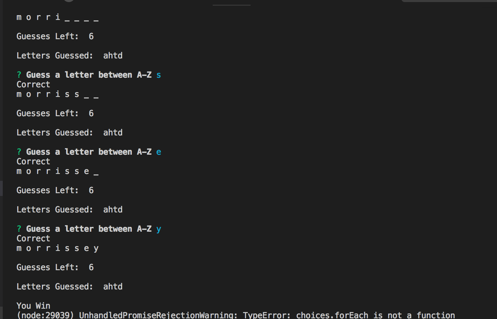

# wordGame
HW11

WORD-GUESS-GAME
---------------

1. GAME- this is a node based program. it takes a stored array of band names and you can try and get the random generated one. 

PACKAGES USED
-------------
inquirier 
is-letter

index.js: Contains the functionality for the program. Picks a word at random. the Word constructor will then store it. it guides the user through each guess and lets them know how many guesses they have remaining. 

Letter.js: Contains constructor Letter. displays the blank spaces. shows if the user has guessed or not.

Word.js: Contains a constructor Word. works with Letter consturctor. Used to create an object for the current word the user is trying to guess correctly. 

$$$$$ Screenshot of you entered nothing $$$$$$$$

$$$$$$ Screenshot of play again options $$$$$$$$

$$$$$$ Screenshot of you lose $$$$$$$$$$

$$$$$$ Screenshot of you win $$$$$$
